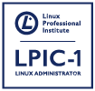

# LPIC-1

Guía de estudio de preparación para la certificación LPIC-1.

LPIC son las siglas de **Linux Professional Institute Certification**.



A fecha de 03/04/2019 esta certificación se encuentra en la versión 5.0 y los códigos de examen son 101-500 y 102-500. El examen no esta disponible en idioma español, aunque la version 4.0 esta disponible hasta Julio de 2019.

Se divide en dos exámenes: :+1:

- Examen 101
- Examen 102

## Objetivos del examen 101

- [ ] [Tema 101: Arquitectura del Sistema](docs/101-500/Tema_101.md)
- [ ] [Tema 102: Instalación de Linux y gestión de paquetes](docs/101-500/Tema_102.md)
- [ ] [Tema 103: Comandos GNU y Unix](docs/101-500/Tema_103.md)
- [ ] [Tema 104: Dispositivos, sistemas de archivos Linux y el estándar de jerarquía de archivos](docs/101-500/Tema_104.md)

## Objetivos del examen 102

- [ ] [Tema 105: Shells y scripts](docs/102-500/Tema_105.md)
- [ ] [Tema 106: Interfaces de usuario y escritorios](docs/102-500/Tema_106.md)
- [ ] [Tema 107: Tareas administrativas](docs/102-500/Tema_106.md)
- [ ] [Tema 108: Servicios esenciales del sistema](docs/102-500/Tema_107.md)
- [ ] [Tema 109: Fundamentos de redes](docs/102-500/Tema_108.md)
- [ ] [Tema 110: Seguridad](docs/102-500/Tema_109.md)

Al obtener esta certificación se obtiene los conocimientos necesarios para:

- Comprender la arquitectura de un sistema Linux.
- Instalar y mantener una estación de trabajo Linux, incluyendo X11 y su configuración como un cliente de red.
- Trabajar en la línea de comandos de Linux, incluidos los comandos comunes de GNU y Unix.
- Manejar archivos y permisos de acceso, así como la seguridad del sistema.
- Realizar tareas de mantenimiento: ayudar a los usuarios, agregar usuarios a un sistema más grande, realizar copias de seguridad y restaurar, apagar y reiniciar.

Al obtener esta certificación se garantiza que has adquirido unos conocimientos suficientes para resolver los problemas más comunes con los que te puedes encontrar cuando trabajas con sistemas UNIX.

## FAQ

### Preguntas para resolver sobre la certificación

**¿El examen se puede realizar en español?**  
Si, tanto en español como en inglés.

**¿Cómo son los exámenes?**  
Cada examen tiene 60 preguntas tipo test de selección múltiple o preguntas de rellenar.

**¿Cuanto dura el examen?**  
Se dispone de 90 minutos

**¿Qué nota tengo que sacar para superar cada examen?**  
Cada examen tiene un peso de 800 puntos. Deberás obtener al menos 500 en cada examen.

**¿Qué significa eso del peso de las preguntas**
El peso de las preguntas en cada una de las partes del examen, significa que si un apartado tiene un peso de 4, en el examen habrá 4 preguntas de ese tema.

**¿Cuánto cuesta el examen?**  
170€ aprox. cada examen. Tienes que hacer los dos para obtener la certificación.

**¿Durante qué tiempo es válida la certificación?**  
Tu certificación LPIC-1 será válida durante 5 años.

**¿Dónde se realizan los exámenes?¿Presencial o online?**  
Los exámenes se realizan de forma presencial en centros asociados o centros PearsonVue. Puedes consultar tu centro más cercano [aquí](https://wsr.pearsonvue.com/testtaker/registration/SelectTestCenterProximity/LINUXPROFESSION?conversationId=1290514)

El centro mas cercano en madrid esta en:

```
AZPE Centro de Estudios
c/ Gran Via 40, 1ª (Metro Callao)
28013 Madrid
Spain
Phone:
0034915323659
```

**¿Qué debo hacer si quiero presentarme al examen?**

1. Debes estar registrado en la Linux Professional Institute para obtener un _LPI ID_. Pues registrarte [aquí](https://cs.lpi.org/caf/Xamman/register). Tardan 24 h en generarte el ID.
2. Registrarte en PearsonVue utilizando el _LPI ID_ [aquí](https://home.pearsonvue.com/lpi).
3. Buscar un centro mas cercano de PearsonVue.

## Enlaces

[Wiki con los objetivos de la version 5.0](<https://wiki.lpi.org/wiki/LPIC-1_Objectives_V5.0(ES)>)

[Wiki del contenido en github](https://github.com/appijumbo/Linux-LPIC-1/wiki)

[Materiales de estudio en español](http://www.lpifit.com/course/)

[Consola de linux Online](https://www.tutorialspoint.com/unix_terminal_online.php)

[Cursos oficiales PUE](https://www.pue.es/cursos/lpi)

[FAQ LPIC](mbRadvvMT51IjsN8gsTz)

### Documentación oficial Linux

[The Linux Document Project](http://www.tldp.org/)

[GNU Project](http://www.gnu.org/doc/)

[Man pages](https://linux.die.net/man/)

[Free Software Directory](https://directory.fsf.org/wiki/Main_Page)

### Blog's

[Blog de contenido Linux](http://www.linuxlinks.com)

[Systemadmin.es](http://systemadmin.es/)

### Videos

[Lista de reproducción de youtube LPIC-1](https://www.youtube.com/watch?v=Fov9nM-AbSw&list=PLD_mb6U5Xp95cX_CDO3Cg-p8370lPwRR2)

[The Linux man](https://www.youtube.com/channel/UCVQ7kPpJJ2FA_iYl8Wtx0SA)

### Canales de ayuda

[Freenode](https://webchat.freenode.net)

[Buscador de canales IRC](http://irc.netsplit.de/channels/)

[Canal Freenode para principiantes](http://irc2go.com/webchat/?net=freenode&room=%23linux-beginners)

### Cursos de pago por suscripción online

[Openwebminars LPIC-1 ](https://openwebinars.net/carreras/certificacion-lpic-1/)

[Linux Academy](https://linuxacademy.com/cp/modules/view/id/214)

### Mas información

[Free Software Fundation](https://www.fsf.org/)

Distribuciones

[ArchLinux](<https://wiki.archlinux.org/index.php/Main_page_(Espa%C3%B1ol)>)
