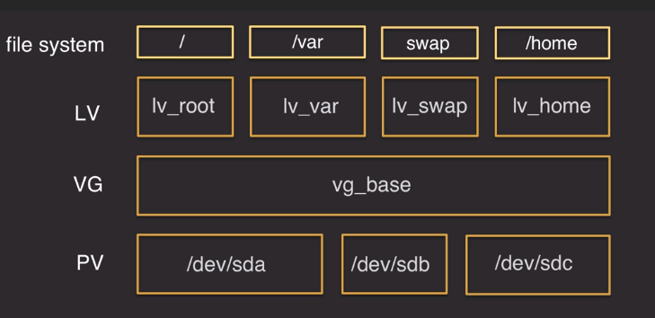

- [Tema 102: Instalación de Linux y gestión de paquetes](#tema-102-instalaci%C3%B3n-de-linux-y-gesti%C3%B3n-de-paquetes)
  - [102.1 Diseño del esquema de particionado del disco](#1021-dise%C3%B1o-del-esquema-de-particionado-del-disco)
    - [LVM - Logical volumen manager](#lvm---logical-volumen-manager)
  - [102.2 Instalar un gestor de arranque](#1022-instalar-un-gestor-de-arranque)
    - [Como instalar grub](#como-instalar-grub)
  - [GRUB2](#grub2)
      - [Master Boot Record](#master-boot-record)
      - [Guid Partition Table](#guid-partition-table)
  - [102.3 Gestión de librerías compartidas](#1023-gesti%C3%B3n-de-librer%C3%ADas-compartidas)
  - [102.4 Gestión de paquetes Debian](#1024-gesti%C3%B3n-de-paquetes-debian)
    - [Usando debian package tool(dpkg)](#usando-debian-package-tooldpkg)
  - [102.5 Gestión de paquetes RPM y YUM](#1025-gesti%C3%B3n-de-paquetes-rpm-y-yum)
    - [YUM](#yum)
    - [RPM](#rpm)
  - [102.6 Linux como sistema virtualizado](#1026-linux-como-sistema-virtualizado)
# Tema 102: Instalación de Linux y gestión de paquetes

- [ ] 102.1 Diseño del esquema de particionado del disco duro duro
- [ ] 102.2 Instalar un gestor de arranque
- [ ] 102.3 Gestión de librerías compartidas
- [ ] 102.4 Gestión de paquetes Debian
- [ ] 102.5 Gestión de paquetes RPM y YUM
- [ ] 102.6 Linux como sistema virtualizado

## 102.1 Diseño del esquema de particionado del disco

### LVM - Logical volumen manager

Nos permite crear grupos de discos o particiones que pueden ser montadas en un o varios sistemas de ficheros(fylesystems).

- Se puede utilizar para montar cualquier punto EXCEPTO /boot.
- Nos ofrece la flexibilidad de redimensionar los volúmenes ya creados.
- Podemos crear Snapshoots de los volúmenes lógicos.

Ejemplo de las capas de un grupo LVM.



`psv`: Lista los volumenes fisicos que existen en un gru po LVM.

`vgs`: list los grupos de volumenes que hay un en grupo LVM.

`lvs`: Lista los volumenes *logicos* que hay en un grupo LVM.


## 102.2 Instalar un gestor de arranque

Legacy Grub

GRUB es el antiguo gestor de arranque y significa **Grand Unified Boot Loader**, esta instalado sobre el MBR. 

En este tipo de gestor de arranque el funcionamiento es el siguiente:

- Paso 1: La bios arranca y lee información de la `boot.img` (los primeros 512 bytes del MBR)
- Paso 1.5: Se lee la información del fichero `core.img`.
- Paso 2: El sistema lee el menu de GRUB del fichero `/boot/grub/grub.conf - menu.lst o device.map 

Ejemplo del fichero grub.conf

```
default=0 # indica que 
timeout=10 #los segundos que aparecera el menu de grub
splashimage=(hd0,0)/grub/splash.xpm.gz #

# section to load Linux
title Red Hat Enterprise Linux (2.4.21-1.ent) #El kernel que va arrancar por defecto (default=0)
        root (hd0,0) #el disco que va ha utlizar como boot [title 0]
        kernel /vmlinuz-2.4.21-1 ro root=/dev/sda2
        initrd /initrd-2.4.21-1.img #la imagen del disco de RAM

# section to load Windows
title Windows #default = 1 en caso de querer arrancar por defecto este disco
        rootnoverify (hd0,0)
        chainloader +1
```


### Como instalar grub

Si queremos buscar en que dispositivo esta el fichero de arraque utilizamos `findmnt /boot`

Para instalar grub en un disposito, por ejemplo un disco duro utiliamos el comando `grub-install [device]`

Si estuviera en /dev/vda1 usamos `grub-install /dev/vda`

>Normalmente este comando se ejecuta con un pendrive, nunca con el sistema arrancado.

---

## GRUB2

Es la segunda generación para el arranque del sistema.

Es importante entender la diferencia entre MBR y GPT.

#### Master Boot Record

- Soporta un máximo de 26 particiones (4 particiones, con una particion extendida hasta 23 particiones lógicas)
- Las particiones solo soportan 2TB.
  
#### Guid Partition Table

- Soporta 128 particiones
- Las particiones soporta hasta un ZB.
- Necesita una BIOS con UEFI.
  - Previene que arranquen sistemas operativos no autorizados.
  - Requiere sistemas de 64bits.
  - Remplaza la tradicional BIOS aunque puede actuar en modo Legacy BIOS.

**¿Cómo arranca un sistema con GRUP2 con GPT utilizando UEFI BIOS?**
- Paso 1: Busca el MBT en los primeros 521 bytes usando la imagen `bios.img` 
  - GTP header - Particion Entry Array.
- Paso 1.5: Normalmente sectores vacios `boot.img`
  - `/boot/efi`  con el sistema de ficheros **vfat** o **FAT32**
- Paso 2: Lee el contenido de `/boot/grub2` grubenv y themes

Ficheros que podemos encontrar en la caprta de arranque en un sistema ubuntu

```
 sergio@Lenovo-ideapad-710S-Plus-13IKB  ~  sudo ls /boot/efi/EFI/ubuntu
BOOTX64.CSV  fw  fwupx64.efi  grub.cfg	grubx64.efi  mmx64.efi	shimx64.efi
```

>Distribuciones Red Hat = grub2-\<comando>

>Distribuciones debian = grub-\<comando> 


`grub2-editenv list` - Muestra la entrada por defecnto del fichero de configuración.

`grub2-mkconfig` - crea o actualiza el fichero de configuracion basado en la entrada de `/etc/default/grub`.

`update-grub` - comando que puede ser utilizado para actualizar la configuracion de GRUB2 despues de hacer cambios en `/etc/default/grub`
.(En sistemas Debian)

Cambiamos el fichero de grub

>nano /etc/default/grub

Actualzamos el fichero de grub

>sudo update-grub

---


Interacting with the Boot Loader


## 102.3 Gestión de librerías compartidas


## 102.4 Gestión de paquetes Debian

`apt` - instala aplicaciones y dependencias, desisntala y actualiza aplicaciones.

Lee los repositorios del fichero `/etc/apt/source.list`.

`sudo apt-get update` - Actualiza el cache de los paquetes que pueden ser actualizados(pero no los instala).

`sudo apt-get upgrade` - Instala las actualizaciones de los paquetes disponibles que ha encontrado con el comando anterior.

`sudo apt-get install` - Instala el paquete indicando el nombre.


`sudo apt-get remove chromium-browser` - desinstala el paquete del sistema, pero no elimina los ficheros de configuración que pueda haber dejado.

`sudo apt autoremove` - sirve para eliminar todas los paquetes que dependen del paquete que hemos desinstalado. 

`sudo apt-get purge chromium-browser` - elimina todos los paquetes del sistema y los ficheros asociados a su configuración.

`sudo apt-get dist-upgrade` - actualiza **todos** los paquetes del sistema a la siguiente release de la distribución. Incluido la instalacion de nuevos paquetes.(a diferencia de apt-get upgrade que solo instala las actualizaciones).

`apt-get download` - descarga el paquete pero no lo instala.

`sudo apt-cache search apache` - busca en el cache local si existe el paquete nombrado.

`sudo apt-cache show libapache2-mod-bw` - muestra toda la información del paquete nombrado. 

`sudo apt-cache showpkg libapache2-mod-bw` - muestra mas información sobre de donde viene el paquete.

----

### Usando debian package tool(dpkg)

Paquetes .deb que contienen:
- La aplicación o utilidad.
- Archivos de configuración por defecto
- Cómo y donde instalar los ficheros que vienen en el paquete.
- Lista de las dependecias que el paquete requiere. (las dependencias necesitan estar instaladas, dpkg no las instala.)

`dpkg --info` - nos muestra información sobre el paquete nombrado.

`dpkg --status nano` - muestra información pero menos detallada.(**de un paquete ya instalado**). lo podemos usar para comprobar un paquete instalado

```
sergio@Lenovo-ideapad-710S-Plus-13IKB  ~/Downloads  dpkg --info nginx_1.14.0-0ubuntu1.2_all.deb
 new Debian package, version 2.0.
 size 3596 bytes: control archive=764 bytes.
     990 bytes,    17 lines      control              
      64 bytes,     1 lines      md5sums              
 Package: nginx
 Version: 1.14.0-0ubuntu1.2
 Architecture: all
 Maintainer: Ubuntu Developers <ubuntu-devel-discuss@lists.ubuntu.com>
 Installed-Size: 42
 Depends: nginx-core (<< 1.14.0-0ubuntu1.2.1~) | nginx-full (<< 1.14.0-0ubuntu1.2.1~) | nginx-light (<< 1.14.0-0ubuntu1.2.1~) | nginx-extras (<< 1.14.0-0ubuntu1.2.1~), nginx-core (>= 1.14.0-0ubuntu1.2) | nginx-full (>= 1.14.0-0ubuntu1.2) | nginx-light (>= 1.14.0-0ubuntu1.2) | nginx-extras (>= 1.14.0-0ubuntu1.2)
 Section: httpd
 Priority: optional
 Homepage: http://nginx.net
 Description: small, powerful, scalable web/proxy server
  Nginx ("engine X") is a high-performance web and reverse proxy server
  created by Igor Sysoev. It can be used both as a standalone web server
  and as a proxy to reduce the load on back-end HTTP or mail servers.
  .
  This is a dependency package to install either nginx-full (by default),
  nginx-light or nginx-extras.
 Original-Maintainer: Debian Nginx Maintainers <pkg-nginx-maintainers@lists.alioth.debian.org>
```

`dpkg -l vagrant` - muestra la información disponible del paquete instalado.

```
sergio@Lenovo-ideapad-710S-Plus-13IKB  ~/Downloads  dpkg -l vagrant
Desired=Unknown/Install/Remove/Purge/Hold
| Status=Not/Inst/Conf-files/Unpacked/halF-conf/Half-inst/trig-aWait/Trig-pend
|/ Err?=(none)/Reinst-required (Status,Err: uppercase=bad)
||/ Name           Version      Architecture Description
+++-==============-============-============-=================================
ii  vagrant        1:2.2.4      amd64        no description given
```

`sudo dpkg -i nginx_1.14.0-0ubuntu1.2_all.deb` - instala un paquete deb.

`dpkg --contents nginx_1.14.0-0ubuntu1.2_all.deb` - Muestra el contenido de un paquete `deb`

```
sergio@Lenovo-ideapad-710S-Plus-13IKB  ~/Downloads  dpkg --contents nginx_1.14.0-0ubuntu1.2_all.deb
drwxr-xr-x root/root         0 2018-11-06 19:54 ./
drwxr-xr-x root/root         0 2018-11-06 19:54 ./usr/
drwxr-xr-x root/root         0 2018-11-06 19:54 ./usr/share/
drwxr-xr-x root/root         0 2018-11-06 19:54 ./usr/share/doc/
drwxr-xr-x root/root         0 2018-11-06 19:54 ./usr/share/doc/nginx/
-rw-r--r-- root/root      8748 2018-04-06 07:31 ./usr/share/doc/nginx/copyright
lrwxrwxrwx root/root         0 2018-11-06 19:54 ./usr/share/doc/nginx/changelog.Debian.gz -> ../nginx-core/changelog.Debian.gz
```

`dpkg -L vagrant` - nos muestra todos los ficheros que fueron instalados con el paquete.

`sudo dpkg -r htop` - desinstala el paquete htop. (no elimina los ficheros de configuración).

`sudo dpkg -P htop` - elimina el paquete y todos los ficheros de configuración.

`dpkg -S nano` - busca en la base de datos de los paquetes y muestra cualquier mencion que incluya el nombre del paquete introducido.

`sudo dpkg reconfigure` - sirve para re lanzar el proceso de configuración de una aplicación ya instalada, por ejemplo un servidor web o una base de datos.

```
sudo dpkg-reconfigure console-setup
```

----

## 102.5 Gestión de paquetes RPM y YUM

### YUM
Por ejemplo, imaginemos que al instalar un paquete RPM, nos encontramos con el problema de que requiere de dependencias que no tenemos instaladas.

Para saber la dependencia de un paquete. Por ejemplo: 


```
console
[cloud_user@ip-10-0-1-94 Downloads]$ yum provides libmozjs185*
Loaded plugins: fastestmirror
Loading mirror speeds from cached hostfile
 * base: mirrors.advancedhosters.com
 * extras: mirrors.advancedhosters.com
 * updates: mirrors.advancedhosters.com
1:js-1.8.5-20.el7.i686 : JavaScript interpreter and libraries
Repo        : base
Matched from:
Provides    : libmozjs185.so.1.0


1:js-1.8.5-20.el7.x86_64 : JavaScript interpreter and libraries
Repo        : base
Matched from:
Provides    : libmozjs185.so.1.0()(64bit)


1:js-1.8.5-20.el7.x86_64 : JavaScript interpreter and libraries
Repo        : @base
Matched from:
Provides    : libmozjs185.so.1.0()(64bit)
```

identificamos que el paquete principal es Javascript.

>1:js-1.8.5-20.el7.x86_64 : JavaScript interpreter and libraries

### RPM


## 102.6 Linux como sistema virtualizado
