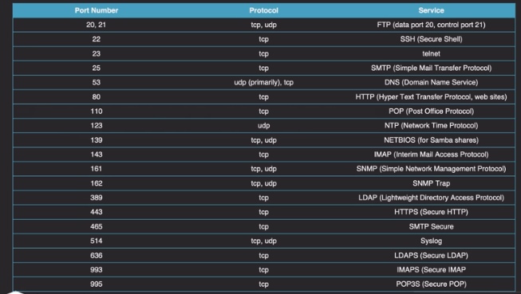

# 109: Fundamentos de redes

## 109.1 Fundamentos de los protocolos de Internet

### Fundamentos de red

- **TCP** Transmission Control Protocol
- **UDP** User Datagram Protocol
- **ICMP** Internet Control Message Protocol, se utiliza para enviar mensajes entre dispositivos(switches, firewall, etc).

Los rangos de IP se describen en el [RFC1918](https://tools.ietf.org/html/rfc1918).

- Clase A: Ragngo 1 -126
- Clase B: Rango 128 - 191
- Clase C Rango 192 -223

Mascaras de red:

- Clase A: 255.0.0.0/8
- Clase B: 255.255.0/16
- Clase C: 255.255.255.0/24

**Gateway**
**Broadcast Address**

---

### Common Networking Services

Es necesario memoriazar el puerto, el protocolo y el servicio.



## 109.2 Configuración de red persistente

### Network manager

`nmcli` - comando para ver los interfaces de red.
`nmcli dev show` - muestra toda la informacion de los interfaces de red.

Nombres de los dispositivos de red

Nomenclatura principal:

- **en** = ethernet
- **wl** = wireless

- eo1 = onboar devices, indexado por la bios o el firmware.
- ens1 = dispositvos en PCI Express hotplug slot, indexado por la BIOS o firmware.
- enp2s0 - dispositivios físicos. (p=bus, s=slot)
- eht0 - antiguo.

`nmcli con show` - para ver las conexiones que tenemos establecidas.

Tirar abajo un dispositivo de red:

```
nmcli con down "NAME"
```

`nmcli device status` - para ver el estado de los interfaces.

Añadir una nueva conexión y añadir el dns.

```
nmcli con add con-name "backup" type ethernet ip4 192.168.0.202/24 gtw 192.168.0.1 iframe ens11 autoconnect

nmcli con mod bakcup ipv4.dns "192.168.122.1"
```

`iframe` - es el dispositivo que queremos que utilice.

`nmcli con edit` - comando para edir una conexión.

`ip` - comando para modificar la dirección ip, rutas y informacion de los interfaces. Es un proyecto de [iproute2](https://es.wikipedia.org/wiki/Iproute2).

`hostnamectl` - comando para hacer persistente el cambio de hostname

```
hostnamectl -set-hostname "centos07"
```

---

### Herramietas de red antiguas(legact)

net-tools

`ifconfig` - antigua utilidad para las configuraciones de red.

`ifup` - levantar un interface.

`ifdown` - tirar un interface.

`route` - cambiar la routa de acceso de los interfaces.

## 109.3 Resolución de problemas básicos de red

### Pruebas de conexion

`ping` - envia paquetes ICMP pra comprobar la conexión cono otra máquina.

`ping6` - la misma funcionalidad que ping pero para redes IPv6.

`traceroute` - muestra ala lista de saltos que el paquete tiene que atravesar para llegar a su destino. Envia paquetes ICMP, algunos firewall bloquean este tipo de paquetes.

Enviamos paquetes TCP

```
traceroute -T 8.8.8.8
```

`netstat` - antigua herramienta para ver las conexiones que tenemos establecidas

Mostrar conexiones activas y escuchando por el protocolo TCP

```
netstat -tl
```

Mostrar las conexiones activas y escuchando por el protocolo UDP

```
netstat -ul
```

Ver los procesos a sociados a las conexiones que estan escuchando.

```
netstat -tulp
```

`tracepath` - la misma funcionalidad de que traceroute pero para redes IPv6.

`ss` - es el equivalente moderno a netstat, podemos utilizar los mismos parámetros para ver la informacion.

## 109.4 Configuración DNS en el lado del cliente

### The Basics of DNS Resolution from Linux

`/etc/host` - ficher que contiene la direccion de loopbak de IPv4 y IPv6, se puede utilizar para asignar cual ip a un DNS sin que pase por un DNS externo.

`/etc/hostname/` - contiene el nombre de la maquina. Con el comando **hostnamectl** pordemos cambiar el nombre y que sea permanente.

`/etc/resolv.conf` - contiene los servidores de nombres (DNS) que la máquina utiliza para consultar las direcciones de nombres asiganadas a las IP.

`/etc/nsswitch.conf` - este fichero es usado para determinar el orden de como se resuelven los nombres.

`hosts` - resuleve la ip dandole un nombre, tambien podemos ver los servidores de correo. Los numeros equivialen a la prioridad de entrega.

```s
host sergiosoriano.es
sergiosoriano.es has address 104.24.101.12
sergiosoriano.es has address 104.24.100.12
sergiosoriano.es has IPv6 address 2606:4700:30::6818:650c
sergiosoriano.es has IPv6 address 2606:4700:30::6818:640c
sergiosoriano.es mail is handled by 1 aspmx.l.google.com.
sergiosoriano.es mail is handled by 10 alt4.aspmx.l.google.com.
sergiosoriano.es mail is handled by 5 alt1.aspmx.l.google.com.
sergiosoriano.es mail is handled by 10 alt3.aspmx.l.google.com.
sergiosoriano.es mail is handled by 5 alt2.aspmx.l.google.com.
```

`dig` - se utiliza para realizar una query a los servidores de DNS.

Realizamos una consulta al DNS para saber que direccion equivale mi página web.

```s
dig sergiosoriano.es

; <<>> DiG 9.11.3-1ubuntu1.7-Ubuntu <<>> sergiosoriano.es
;; global options: +cmd
;; Got answer:
;; ->>HEADER<<- opcode: QUERY, status: NOERROR, id: 14907
;; flags: qr rd ra; QUERY: 1, ANSWER: 2, AUTHORITY: 0, ADDITIONAL: 1

;; OPT PSEUDOSECTION:
; EDNS: version: 0, flags:; udp: 4096
;; QUESTION SECTION:
;sergiosoriano.es.		IN	A

;; ANSWER SECTION:
sergiosoriano.es.	158	IN	A	104.24.100.12
sergiosoriano.es.	158	IN	A	104.24.101.12

;; Query time: 2 msec
;; SERVER: 192.168.0.1#53(192.168.0.1)
;; WHEN: Thu Jun 20 07:14:40 CEST 2019
;; MSG SIZE  rcvd: 77
```

Con **-t** seguido del tipo de registro (MX) consultamos los registros concretos del dominio en cuestión.

```s
dig -t MX sergiosoriano.es

; <<>> DiG 9.11.3-1ubuntu1.7-Ubuntu <<>> -t MX sergiosoriano.es
;; global options: +cmd
;; Got answer:
;; ->>HEADER<<- opcode: QUERY, status: NOERROR, id: 57448
;; flags: qr rd ra; QUERY: 1, ANSWER: 5, AUTHORITY: 0, ADDITIONAL: 7

;; OPT PSEUDOSECTION:
; EDNS: version: 0, flags:; udp: 512
;; QUESTION SECTION:
;sergiosoriano.es.		IN	MX

;; ANSWER SECTION:
sergiosoriano.es.	41	IN	MX	1 aspmx.l.google.com.
sergiosoriano.es.	41	IN	MX	10 alt4.aspmx.l.google.com.
sergiosoriano.es.	41	IN	MX	5 alt1.aspmx.l.google.com.
sergiosoriano.es.	41	IN	MX	10 alt3.aspmx.l.google.com.
sergiosoriano.es.	41	IN	MX	5 alt2.aspmx.l.google.com.

;; ADDITIONAL SECTION:
alt2.aspmx.l.google.com. 229	IN	A	74.125.200.26
alt2.aspmx.l.google.com. 229	IN	AAAA	2404:6800:4003:c00::1b
aspmx.l.google.com.	229	IN	A	64.233.167.26
aspmx.l.google.com.	229	IN	AAAA	2a00:1450:400c:c07::1b
alt1.aspmx.l.google.com. 229	IN	A	108.177.14.26
alt1.aspmx.l.google.com. 229	IN	AAAA	2a00:1450:4010:c0f::1b

;; Query time: 6 msec
;; SERVER: 192.168.0.1#53(192.168.0.1)
;; WHEN: Thu Jun 20 07:16:37 CEST 2019
;; MSG SIZE  rcvd: 295
```

Podemos consultar los registros, utilizando otro DNS con la arroba

```s
dig @8.8.8.8 -t A google.es

; <<>> DiG 9.11.3-1ubuntu1.7-Ubuntu <<>> @8.8.8.8 -t A google.es
; (1 server found)
;; global options: +cmd
;; Got answer:
;; ->>HEADER<<- opcode: QUERY, status: NOERROR, id: 21093
;; flags: qr rd ra; QUERY: 1, ANSWER: 1, AUTHORITY: 0, ADDITIONAL: 1

;; OPT PSEUDOSECTION:
; EDNS: version: 0, flags:; udp: 512
;; QUESTION SECTION:
;google.es.			IN	A

;; ANSWER SECTION:
google.es.		299	IN	A	172.217.17.3

;; Query time: 29 msec
;; SERVER: 8.8.8.8#53(8.8.8.8)
;; WHEN: Thu Jun 20 07:22:03 CEST 2019
;; MSG SIZE  rcvd: 54
```

Puedes encontrar mas ejemplos [aquí](https://elbauldelprogramador.com/dig-chuleta-basica-de-comandos/)

`getent` - realiza una query al fichero `/etc/nsswitch.conf` y responde la información de la base de datos a la que corresponda. Mas info [aquí](http://man7.org/linux/man-pages/man1/getent.1.html). Se puede utilizar para consultar los grupos, protocolos, etc.
