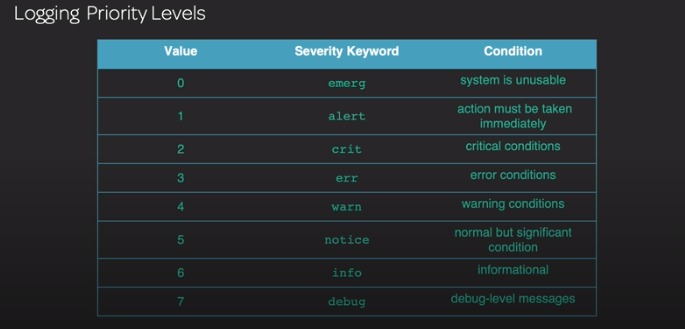
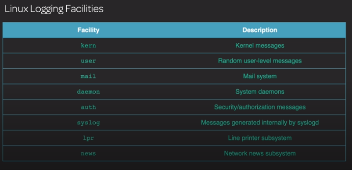

# Tema 105: Shells y scripts

## 105.1 Personalizar y usar el entorno de shell

### Setting Up the Shell Environment

---

### Customizing the Shell Environment

## 105.2 Personalización y escritura de scripts sencillos

### Basic Shell Scripts

---

### Adding Logic to Your Shell Scripts

---

### Bash Loops and Sequences

`for` -

`while` -

`until` -

---

`read` Leemos lo que introducimos por teclado y lo guardamos en la variable GRETTING. `read GREETING`.

`exit` - para especificar el retorno de salida, normalmente seria 0, pero se puede cambiar a otro numero, por ejemplo para salir en un bucle.

`exec` - se puede utilizar para re-direccionar la salida de una shell a un fichero. `exec > out .log`

---

## 106: Interfaces de usuario y escritorios

### 106.1 Instalar y configurar X11

#### 106.1.1 The Basics of X11

X11 lo llevan los antiguos sistemas (CentOS 5)
Wayland - remplaza al sistema de ventas X.

#### 106.1.2 Instalando X11

`yum grouplist` - para ver los grupos de instalaciones.

`yum -y groupinstall "X Windows System"`

x.org se encarga de llevar el proyecto.

Podemos encontrar el fichero de configuración en `/etc/init` y veremos que apunta a `/etc/X11/prefdm`

#### 106.1.3 Configuraciones de X11

`xorg.conf` - fichero de configuración de entorno visual de ventanas X

man `xorg,conf` - para ver toda la documentación sobre la configuración del entorno de ventanas.

`xdpyinfo` - muestra información sobre la sesión de ventanas.

#### 106.1.4 Conexiones gráficas remotas

`xhost` - no usar para entornos de producción. (Se usaba antes) con este comando podemos habilitar o deshabilitar el acceso remoto.

```console
sergio@Lenovo-ideapad-710S-Plus-13IKB  ~  xhost
access control enabled, only authorized clients can connect
SI:localuser:sergio
 sergio@Lenovo-ideapad-710S-Plus-13IKB  ~  xhost -
access control enabled, only authorized clients can connect
 sergio@Lenovo-ideapad-710S-Plus-13IKB  ~  xhost +
access control disabled, clients can connect from any host
```

`xauth` - sirve para editar y ver información de seguridad que permita a los usuarios controlar los clientes de ventanas X11.

`VNC` - Virtual Network computing.

Instalar el servidor de VNV:

`yum install tigervnc-server`

**Demo** de como configurar un servidor VNC y crear una redirección de puertos por ssh para conectarnos de forma segura.

`ssh -C -L 5901:localhost:5901 192.168.122.241`

5901:localhost - puerto y dirección local

5901 192.168.122.241 - puerto y dirección remota

Ahora podemos utilizar la ip local para conectarnos por VNC al escritorio remoto

`SPICE` - Protocolo de conexión seguro encriptado con TLS, permite conexiones con sistemas Windows, linux y android.

---

### 106.2 Escritorios Gráficos

GTK+ : desarrolladas en C

- GNOME
- XFCE

QT : desarrolladas en C++

- KDE

### 106.3 Accesibilidad

Configuración especifica de accesibildad, como zoom, punteros, lectura de ventanas por voz, etc.
Orca permite la configuración de accesibilidad, centrándonos en la configuración de screen reader.

# 107: Tareas Administrativas

## 107.1 Administrar cuentas de usuario y de grupo y los archivos de sistema relacionados con ellas

### Añadir y eliminar usuarios

`useradd`

```console
sudo useradd -m name
```

Usamos `-m` para crear el home del usuario.
En algunas distribuciones no es necesario utilizar -m, ya que crean automáticamente la carpeta.

Creamos un usuario que utilice una shell diferente.

```console
sudo  useradd -m -c "Juanjo Garcia" -s /bin/tcsh \ juanjo
```

Podemos comprobar la shell con `echo $SHELL` que nos devolverá el valor de la shell que el usuario esta utilizando.

`passwd` - comando para asignar un password al usuario.

Asignamos un password temporal con `-e` al usuario juanto

```
sudo passwd -e juanjo
```

`userdel` - comando para eliminar un usuario.

Elimina el usuario y borra las carpetas de home.

```
userdel -r juanjo
```

---

### Añadir y eliminar grupos

`groups` - comando para conocer los grupos primarios y secundarios de los que forma parte el usuario.

`groupadd` - añade un nuevo grupo.

Creamos un grupo legal y creamos un usuario y lo añadimos a ese grupo.

```
sudo groupadd legal
sudo useradd -G legal -m -c "Mario Gonzalez" \ mgonzalez
```

## `groupdel` - comando para borrar un grupo.

### Usuarios y configuración de ficheros de grupo

`/etc/passwd` - fichero que contiene las cuentas de usuario del sistema.

Las columnas se separan por el carácter `:` y cada una de las columnas significa:

1. Nombre de usuario
2. X password encriptado
3. User id (las cuentas por encima de un id 1000 son cuentas de usuario "normales")
4. Primary Group id
   5 .User id info
5. Directorio del home de usuario
6. bash que utiliza el usuario (si no ha iniciado sesion aparecera nologin)

`/etc/shadow` - fichero que contiene las password encriptadas de los usuarios. Justo después del nombre de usuario aparece el tipo de cifrado que utiliza la contraseña.

```
$1$ = MD5
$2a$,$2y$ = Blowfish
$5$ = SHA-256
$6$ = SHA-512
```

Las columnas que podemos encontrar en el fichero `/etc/shadow` son las siguientes:

1. Nombre usuario
2. Algoritmo de cifrado, y hash.
3. Tiempo desde 1 enero de 1970.
4. Los días que han pasado desde que el usuario a cambiado el password.
5. El tiempo de días que es valido el password.
6. Los días que sera avisado antes de que expire el password.
7. empty
8. empty.

Si una cuenta tiene en la segunda columna los caracteres de `!!` significa que esta bloqueada.

`/etc/group` - fichero que contiene información sobre los grupos de usuarios.

1. Nombre del grupo
2. Password del grupo.
3. ID del grupo.
4. los usuarios que forman parte del grupo.

---

### Modificaciones de usuarios y grupos

`usermod` - este comando se utiliza para modificar configuraciones de usuarios ya existentes.

`change` - este comando puede listar y modificar los parámetros de expiración de password y expiración de la cuenta de usuario.

`groupmod` - modifica los atributos de un grupos, como el nombre o ID.

`getent passwd sergio` - muestra información de las bases de datos del sistema. [Enlace](https://www.unixtutorial.org/commands/getent)

---

#### Ejercicios

Añadir un usuario a un grupo ya creado.

`usermod -a -G nombregrupo nombreusuario`

Bloquear una cuenta

`usermod -L nombresusuario`

Creamos una cuenta y la bloqueamos, podemos ver como al pricipio de la ultima linea, aparece un simbolo de exclamación al consultar el fichero shadow indicandonos que la cuenta ha sido bloqueada.

```console
sergio@Lenovo-ideapad-710S-Plus-13IKB  ~  sudo getent shadow test
test:$6$HPi6/BE7$a22bOjrx8EbVgiEdl8IMHZwSeabQX568ydN88oD3pc301BkfFgqIDClkWPS2ihjVOdL8rm./pH5M4XkYXSLik.:18055:0:99999:7:::
 sergio@Lenovo-ideapad-710S-Plus-13IKB  ~  usermod -L test
usermod: Permission denied.
usermod: cannot lock /etc/passwd; try again later.
 ✘ sergio@Lenovo-ideapad-710S-Plus-13IKB  ~  sudo usermod -L test
 sergio@Lenovo-ideapad-710S-Plus-13IKB  ~  sudo getent shadow test
test:!$6$HPi6/BE7$a22bOjrx8EbVgiEdl8IMHZwSeabQX568ydN88oD3pc301BkfFgqIDClkWPS2ihjVOdL8rm./pH5M4XkYXSLik.:18055:0:99999:7:::
```

Para desbloquearla utilizamos.

`usermod -U test`

Creamos una cuenta del sistema y modificamos su shell y su carpeta de home.

```
useradd -r projectx
usermod -s /sbin/nologin
userdmod -d /opt/projectx projectx
```

En la ultima linea indicamos la nueva ruta del home y el usuario que queremos modificar.

Por último, asignamos como propietario a la carpeta:

```console
sudo chmod projext:projectx /opt/projectx
```

## 107.2 Automatizar tareas administrativas del sistema mediante la programación de trabajos

### CRON

Lo utilizamos para programar tareas que van a ser ejecutadas en periodos de tiempo que nosotros decidamos.

`contrab -e` - para modificar el fichero de cron.

`/etc/crontab` - fichero con los trabajos programados del sistemas

`/etc/cron.d/` - directorio que contiene los trabajos progrmados del sistema. se crea un fichero por cada tarea añadida.

1. Minutos
2. Horas
3. Dia del mes (podemos usar \* para indicar que no importa el dia que sea)
4. Mes (\* si no nos importa el mes).
5. Dia de la semana(sat, para que se ejecute los sábados).
6. Username(el usuario que ejecuta la tarea).
7. La tarea que queremos que ejecute.

[Ejemplos](http://researchhubs.com/post/computing/linux-cmd/awesome-crontab-job-examples.html)

Los ficheros de las configuracion de cada uno de los usuarios son creados en:

`sudo cat /var/spool/cron/crontabs/sergio`

Podemos utilizar `crontab -l` para ver las tareas programadas del usuario.

Para borrar el contenido el fichero de cron usamos el comando `crontab -r`.

Si queremos borrar el de un usuario:

`crontab -r -u sergio`

Podemos bloquear a un usuario para que no pueda crear cron añadiendolo al fichero `/etc/cron.denny`

### At

Se utiliza para ejecutar una tarea en un determinado momento, al contrario de cron que sirve para programar de una forma repetitiva.

> Por defecto no suele venir instalada en las distribuciones Linux

Programamos una tarea para que se ejecute dentro de 5 minutos para que cre un fichero llamado notes.txt con el contenido pasado con echo:

`atq` - sirve para ver las tareas programadas.

```
at now + 5 minutes
warning: commands will be executed using /bin/sh
at> echo "Notas para luego:" > /home/sergio/notes.txt
at> <EOT>
job 1 at Sat Jun  8 16:16:00 2019
 sergio@Lenovo-ideapad-710S-Plus-13IKB  ~  atq
1	Sat Jun  8 16:16:00 2019 a sergio
```

`atrm` - sirve para eliminar una tarea programada, indicando el numero.

Programar una tarea que ejecute un script en un determinado momento.

```
at -f /root/program.sh 10:15 PM Jul 8
```

Es posible configurar que usuarios pueden utilizar la herramienta `at`, añadiendolos al fichero `at.allow` o denegandolos en `at.deny`.

### Systemd Timer Unit Files

Es un timer controlado por systemd, utilizado en los nuevos sistemas para controlar las tareas repetitivas.

Cada fichero **.timer** tiene que tiener un fichero **.service**, por ejemplo si tienes un fichero foo.timer tienes que tener un fichero foo.service.

Hay dos tipos de timer:

- Monotonic - OnBootSex=, OnActiveSec=
- Realtime - OnCalendar

Se utiliza mas por que la sintaxis es mas sencilla.

Timer unit file:

- [Unit]
- [Timer]
- [Install]

Manuales:

- man 5 systemd.timer
- man 7 systemd.timer

Para ver los timers que tenemos configurado en el sistema y los servicios que tiene asociales:

`systemctl list-timers --all`

```console
sergio@Lenovo-ideapad-710S-Plus-13IKB  ~  systemctl list-timers --all
NEXT                          LEFT          LAST                          PASSED     UNIT                         ACTIVATES
Sat 2019-06-08 17:01:21 CEST  13min left    Sat 2019-06-08 16:02:27 CEST  45min ago  anacron.timer                anacron.service
Sat 2019-06-08 17:09:00 CEST  21min left    Sat 2019-06-08 16:39:09 CEST  8min ago   phpsessionclean.timer        phpsessionclean.service
Sat 2019-06-08 20:29:41 CEST  3h 42min left Sat 2019-06-08 09:32:35 CEST  7h ago     apt-daily.timer              apt-daily.service
Sun 2019-06-09 01:30:57 CEST  8h left       Fri 2019-06-07 19:42:44 CEST  21h ago    motd-news.timer              motd-news.service
Sun 2019-06-09 06:50:37 CEST  14h left      Sat 2019-06-08 09:32:35 CEST  7h ago     apt-daily-upgrade.timer      apt-daily-upgrade.service
Sun 2019-06-09 12:29:09 CEST  19h left      Fri 2019-06-07 19:27:44 CEST  21h ago    systemd-tmpfiles-clean.timer systemd-tmpfiles-clean.service
Mon 2019-06-10 00:00:00 CEST  1 day 7h left Mon 2019-06-03 00:27:52 CEST  5 days ago fstrim.timer                 fstrim.service
n/a                           n/a           n/a                           n/a        snapd.snap-repair.timer      snapd.snap-repair.service
n/a                           n/a           Fri 2019-06-07 19:13:37 CEST  21h ago    ureadahead-stop.timer        ureadahead-stop.service
```

`systemctl cat anacron.timer`

Podemos ver la descripción, el momento de ejecución y el apartado install.

```console
sergio@Lenovo-ideapad-710S-Plus-13IKB  ~  systemctl cat anacron.timer
# /lib/systemd/system/anacron.timer
[Unit]
Description=Trigger anacron every hour

[Timer]
OnCalendar=hourly
RandomizedDelaySec=5m
Persistent=true

[Install]
WantedBy=timers.target
```

`system-ctl cat anacron.service`

También podemos crear un timer que no requere un fichero `.service` ejecutado:

`systemd-run --on-active=1m /bin/touch /home/sergio/hello`

## 107.3 Localización e internacionalización

### Trabajando con la localizacion del sistema

`locale` - comando para mostrar la información de configuracion del lenguaje del sistema.

`localectl` - comando para configurar el idioma por defecto y el lenguaje del sistema.

Podemos mostrar la lista de idiomas con:

`localectl list-locales`

`iconv` - utilidad usada para convertir ficheros de un tipo de codificación a otro.

> UTF-8 es el sistema de caracetes codificados más utilizado.

Para cambiar el idioma, podemos cambiar la variable entorno `LANG`

`LANG=pl_PL.utf8`

`LANG=C`

### Hora y fecha en los sitemas Linux

`date` - muestra información sobre la fecha actual. Podemos utilizar valores para formatear la salida por pantalla en diferentes formatos. Es intereante conocer formatear la salida de la fecha a la hora de utilizar scripts.

```console
 sergio@Lenovo-ideapad-710S-Plus-13IKB  ~  date +%m/%d/%Y
06/08/2019
```

`timedatectl` - muestra la hora actual del sistema y la del hardware (RTC clock).

Mostramos la lista de horarios disponibles y cabiamos a "Antartica/davis".

```
timedatectl list-timezones
timedatectl set-timezone "Antartica/Davis"
```

`tzselect` - comando para seleccionar por menu la zona horaria que queremos.

`/etc/localtime` - fichero para distribuciones REDHAT.
`/etc/timezone` - fichero para distribuciones DEBIAN.
`/usr/share/zoneinfo` - directorio que contiene todas las zonas dispoibles que el equipo puede configurar.

# Tema 108: Servicios esenciales del sistema

## 108.1 Mantener la hora del sistema

Tenemos que saber como configurar nuestro equipo para recibir la hora de un servidor de NTP.

### Trabajando con servidores remotos de tiempo(NTP)

**NTP** - Network Time Protocol

:Capas del protocolo
Stratum 0  
 Stratum 1
Stratum 2

`ntpd` - es el demonio(servicio) que comprueba contra el servidor de ntp para comprobar si la hora es correcta.

`ntpdate` - comando para recibir la hora de un servidor de ntp especifico, es necesario que el servicio no este corriendo.

`/etc/ntp.conf/` - fichero de configuracion para el demonio de ntpd.

`ntpq` - comando para realizar una query al demonio **ntpd**.

`timedatectl` - comando para comprobar la configuración del servidor ntp

`chronyd` - es el demonio moderno que los equipos que utilizan **systemd**.

`/etc/chrony/chrony.conf` - fichero de configuración al igual que el antiguo fichero `ntp.conf`.

`chronyc` - comando para consultar la información del demonio **chronyd**.

## 108.2 Registros del sistema

## Sistemas de Logs antiguaos

`/var/log/dmesg` - logs relacionadios con el hardware, consultar en caso de tener problemas con los dispositivos conectados. Se crea cada vez que el sistema arranca.(Linux kernel boot messages).

`/var/log/messages` - log que recoje los problemas con los servicios.

`/var/log/secure` - contiene información de los accesos de los usuarios.

`/var/log/maillog` - contiene información del servidor de correo.

Todos estos logs son gestionados por el antiguo demonio **rsyslog**. (En los sistemas que no utilizan **systemd**).

**Niveles de prioridad de Logs**



**Niveles de logs Facilities**



Podemos ver esta información con el comando:

`dmesg -x`

`logger` - comando que puede ser utilizado para enviar informacion al fichero **/etc/log/messages**.

### Rsyslog

Utilizado en distribuciones anteriores a Centos 7.

`rsyslog` - la configuracion del demonio la podemos encontrar en **/etc/rsyslog.conf**.

Los ficheros de ayuda esta escritos en html y necesitamos lynx:

> yum -y install lynx

Es posibble configurar rsyslog para enviar los log a un servidor remoto.

`/etc/logrotate.conf` - es el fichero de configuración del demonio lograte, encargado de manejar el tamaño y la rotación de los ficheros de log.

`/etc/logrotate.d/` - Configuración avanzanda para que otros demonios puedan

`logrotate` - comando para rotar los ficheros de configuración.

### Introduccion al diario de systemd

Recoge los log de :

- Logs del Kernel
- Logs del sistema
- Servicios del sistem que envian salidas de (standar ouput y standard error)

La ruta por defecto esta en `/run/log/journal` esta informacion se pierde despues de cada reinicio.

Para hacerla permanente teemos que hacer:

```console
mkdir -p /var/log/journal
systemd-tmpfiles --create --prefix /var/log/journal
```

Podemos encontrar mas informacion sobre la condiguración en:

> man 5 journald.conf

El fichero de configuracion se encuentra en `/etc/systemd/journald.conf`

### journalctl

Los sistemas que usan systemd utilizan el comando journalctl(Journal control) para obtener informacion del demonio de logs systemd journal(systemd-journald.service).

`journalctl -n 20` - muestra las entradas mas recientes y limita la salida a 20.

`journalctl -f -u httpd.service` - nos muestra los log de un servicio en particular.

`journalctl -o verbose` - para mostrar todos los log de una forma ordenada.

`journalctl -o json-pretty` - para ver los log en formato json, la salida puede ser tratada para mostrarla en una web por ejemplo. Muy util para analizar los datos.

`systemd-cat` - para enviar una salida de texto al diario de logs.

#### **Demo:**

Tenemos un problema con el servidor web de apache.

Nos logamos como root

`sudo su -`

Comprobamos el estado del servicio:

`systemctl status httpd.service`

Intentamos arrancar el servidor web

`systemctl start httpd.service`

Tras comprobar que no arranca, buscamos en el log.

`journalctl -u httpd.service`

Vemos que nos indica que no puede encontrar el fichero de configuración.

```console
journalctl -u httpd.service
-- Logs begin at Sun 2019-06-09 04:33:02 EDT, end at Sun 2019-06-09 04:46:20 EDT. --
Jun 09 04:45:18 ip-10-0-1-160.ec2.internal systemd[1]: Starting The Apache HTTP Server...
Jun 09 04:45:18 ip-10-0-1-160.ec2.internal httpd[13571]: httpd: Could not open configuration file /etc/httpd/conf/httpd.conf: No such file
Jun 09 04:45:18 ip-10-0-1-160.ec2.internal systemd[1]: httpd.service: main process exited, code=exited, status=1/FAILURE
Jun 09 04:45:18 ip-10-0-1-160.ec2.internal kill[13572]: kill: cannot find process ""
Jun 09 04:45:18 ip-10-0-1-160.ec2.internal systemd[1]: httpd.service: control process exited, code=exited status=1
Jun 09 04:45:18 ip-10-0-1-160.ec2.internal systemd[1]: Failed to start The Apache HTTP Server.
Jun 09 04:45:18 ip-10-0-1-160.ec2.internal systemd[1]: Unit httpd.service entered failed state.
Jun 09 04:45:18 ip-10-0-1-160.ec2.internal systemd[1]: httpd.service failed.
```

Comprobamos si el directorio de configuracion contiene el fichero.

`ls /etc/httpd/conf`

Restauramos el fichero de configuracion

`mv /etc/httpd/conf/httpd.conf.bkup /etc/httpd/conf/httpd.conf`

Reiniciamos el servicio

`systemctl restart httpd.service`

Comprobamos que el servicio esta corriendo correctamente

`systemctl status httpd.service`

utilizamos elinks para comprar que el sitio funciona correctamte

`elinks http://localhost`

#### Demo 2

Queremos programar un backup de una pagina web. Tenemos escrito el scrip que realiza la tarea llamadao `web-backup.sh` y queremos que se ejecute diariamente.

1. Creamos es el scrip
2. Creamos el fichero web-backup.service (especifica que va hacer)
3. Creamos el fichero web-backup.timer (indica cuando se va a ejecutar y por quien)

4. Copiamos el contenido del script a `usr/local/sbin/`

`cp web-backup.sh /usr/local/sbin/`

Y damos permisos de ejecucion sobre el script

`chmod +x /usr/local/sbin/web-backup.sh`

5. Copiamos los ficheros de servicio y timer a `/etc/systemd/system`

`cp web-backup.{service,timer} /etc/systemd/system/

6. Reiniciamos el demonio de systemd

`systemctl daemon-reload`

7. Habilitamos el servicio para que se ejecute al arrancar el sistema.

`systemctl enable web-backup.timer web-backup.service`

> Esto creara los enlaces simbolicos necesarios.

8. Arrancamos los servicios.

`systemctl start web-backup.timer web-backup.service`

9. Comprobamos los servicios

```
systemctl status web-backup.timer
systemctl status web-backup.service
```

## 108.3 Mail Transfer Agent (MTA) Fundamentos

MTA -> MDA (Port 25 TCP) -> MUA

- **MTA**: Mail Transfer Agent
- **MDA**: Mail delivery Agent
- **MUA**: Mail user agent

Conocer el sistema de MTA es el importante para el examen.

Sistemas de MTA más comunes:

`Sendmail` - es el sistema de mta mas antiguo, es difil de configurar y suele venir instalado por defecto en la mayoria de distribuciones de linux.
`Postfix` - es el MTA moderno encontrado en muchas de las distribuciones de linux, es fácil de configurar y tiene una buena segurida.
`Exim` - es el sistema de MTA por defecto en las distribuciones Deabian, tiene una buena seguridad y es mas sencillo de configurar que Sendmail.

`Send Emulation Layer` - los administradores pueden utilizar los comandos de 'sendmail' en otras MTA (Postfix, Exim,etc) como si estuvieran utilizando la instalacion de Sendmail.

### Renvio de Email y Alias

Los alias se utilizan para que utilizando otro nombre se envie a la cuenta que queramos, por ejemplo si tenemos un buzon que se llama sergio@localhost podemos crear un alias para que los correos que se envien a **yo@localhost`** se reciban en el buzón de sergio@localhost

`/etc/aliases` - es el fichero de configuracion que se utiliza para realizar el renvio de correos entre usuarios.

`newaliases` - comando que es necesario lanzar despues de modificar el fichero anterior para que se enere el fichero `/etc/aliases.db` fichero que el MTA usa para entregar los correos.

Para enviar un correo desde la terminal con postfix

`mail -s "Este es un mensaje" sergio@localhost`

Comprobamos la mandeja de entrada:

`mail` - comando para enviar los correos o para ver los correos de un usuario.

`mailq` - comando para ver los correos que estan encolados, esperando a ser enviados a su destino. En sendmail se usaba `sendmail -bp`.

`~/.forward` - un fichero de configuracion que puede ser colocado en el home del usuario para reenviar correos que sean enviados a el y quieran ser enviados a otro usuario o email externo. (solo tenemos que especificar el usuario o el correo en este fichero). [Ejemplo](https://www.ccsf.edu/Pub/UNIXhelp/mail/file_forward.html)

Log del email

`/var/log/maillog/`

#### DEMO:

Configurar el servidor de correo para que reenvie todos los correos que llevan a root al usuario cloud_user.

1. Nos logamos con el usuario root

`sudo su -`

2. Añadimos el alias en el fichero `/etc/aliases`.

`echo "root: cloud_user" >> /etc/aliases`

3. Regeneramos la base de datos de los alias

`newaliases`

4. Enviamos un mensaje de prueba

`mail -s "Probando" -a "/etc/services" root@localhost < /dev/null`

5. Salimos de la sesion de root

`exit`

6. Comprobaoms la badejande entrada

`mail`

```console
[cloud_user@ip-10-0-1-208 ~]$ mail
Heirloom Mail version 12.5 7/5/10.  Type ? for help.
"/var/spool/mail/cloud_user": 6 messages 6 new
>N  1 root                  Fri Jun 14 03:06 11204/671277 "Probando"
 N  2 Mail Delivery System  Fri Jun 14 03:14  73/2622  "Undelivered Mail Returned to Sender"
 N  3 root                  Fri Jun 14 03:20 11204/671259 "Probando"
 N  4 root                  Fri Jun 14 03:22 11204/671259 "Probando"
 N  5 root                  Fri Jun 14 03:24 11204/671259 "Probando"
 N  6 root                  Fri Jun 14 03:25 11204/671259 "Probando"
& 1
Message  1:
```

```
Jun 14 03:25:51 ip-10-0-1-208 postfix/local[4784]: 32C0D43D376: to=<cloud_user@ip-10-0-1-208.ec2.internal>, orig_to=<root@localhost>, relay=local, delay=0.05, delays=0.03/0/0/0.02, dsn=2.0.0, status=sent (delivered to mailbox)
Jun 14 03:25:51 ip-10-0-1-208 postfix/qmgr[4144]: 32C0D43D376: removed
```

## 108.4 Gestión de la impresión y de las impresoras

### The Common Unix Printing System (CUPS)

Instalamos el CUPS driver y el servidor de impresion en ubuntu. Esto nos facilita el manejo mediante un frontal web para administrar las impresoras.

`sudo apt-get install cups printer-driver-cups-pdf`

1. Eliminamos la impresora que viene por defecto(Imprime en PDF), haciendo click en Administración -> Manage Printer -> PDF , seleccionamos en el desplegable de Administration -> Delete.

2. Al terminar de configurarla tenemos que seleccionar que sea la impresora por defecto.

`/etc/cups` - directorio que contiene los ficheros de configuracion del servidor de CUPS.

`/etc/cups/printers.conf` - fichero de configuración de las impresoras, no se debe cambiar cuando el servidor CUPS esta arrancado.

Cargamos la web de administracion de impresión:

`http://localhost:631`

### The Line Print Daemon

Es el domonio de impresión antiguo(legacy)

> El puerto socket para las impresoras es el **9100**

`lpd` - Line Print Daemon

`lpstat` Muestra el estado del servidor de CUPS, las impresoras configuradas y las colas de impresión.

`lpadmin` - herramienta para añadir, modificar y eliminar impresoras.

`lpinfo` - este comando muestra las impresoras disponibles y los drivers que pueden usar.

`lpc` - antiguo comando para mostrar informacion sobre las impresoras.

`lpr` - este comando envia a imprimir el fichero que se indique a la impresora por defecto.

Imprime el fichero de usuarios:

```
lpr /etc/passwd/
```

`lpq` - este comando muestr las colas de impresion del servidor CUPS. Con la opción -a vemos todas las colas de impresion.

`lprm` - sirve para eliminar un trabajo que exista en la cola de impresión indicando el PID:

# 109: Fundamentos de redes

## 109.1 Fundamentos de los protocolos de Internet

### Fundamentos de red

- **TCP** Transmission Control Protocol
- **UDP** User Datagram Protocol
- **ICMP** Internet Control Message Protocol, se utiliza para enviar mensajes entre dispositivos(switches, firewall, etc).

Los rangos de IP se describen en el [RFC1918](https://tools.ietf.org/html/rfc1918).

- Clase A: Ragngo 1 -126
- Clase B: Rango 128 - 191
- Clase C Rango 192 -223

Mascaras de red:

- Clase A: 255.0.0.0/8
- Clase B: 255.255.0/16
- Clase C: 255.255.255.0/24

**Gateway**
**Broadcast Address**

---

### Common Networking Services

Es necesario memoriazar el puerto, el protocolo y el servicio.


## 109.2 Configuración de red persistente

### Network manager

`nmcli` - comando para ver los interfaces de red.
`nmcli dev show` - muestra toda la informacion de los interfaces de red.

Nombres de los dispositivos de red

Nomenclatura principal:

- **en** = ethernet
- **wl** = wireless

- eo1 = onboar devices, indexado por la bios o el firmware.
- ens1 = dispositvos en PCI Express hotplug slot, indexado por la BIOS o firmware.
- enp2s0 - dispositivios físicos. (p=bus, s=slot)
- eht0 - antiguo.

`nmcli con show` - para ver las conexiones que tenemos establecidas.

Tirar abajo un dispositivo de red:

```
nmcli con down "NAME"
```

`nmcli device status` - para ver el estado de los interfaces.

Añadir una nueva conexión y añadir el dns.

```
nmcli con add con-name "backup" type ethernet ip4 192.168.0.202/24 gtw 192.168.0.1 iframe ens11 autoconnect

nmcli con mod bakcup ipv4.dns "192.168.122.1"
```

`iframe` - es el dispositivo que queremos que utilice.

`nmcli con edit` - comando para edir una conexión.

`ip` - comando para modificar la dirección ip, rutas y informacion de los interfaces. Es un proyecto de [iproute2](https://es.wikipedia.org/wiki/Iproute2).

`hostnamectl` - comando para hacer persistente el cambio de hostname

```
hostnamectl -set-hostname "centos07"
```

---

### Herramietas de red antiguas(legact)

net-tools

`ifconfig` - antigua utilidad para las configuraciones de red.

`ifup` - levantar un interface.

`ifdown` - tirar un interface.

`route` - cambiar la routa de acceso de los interfaces.

## 109.3 Resolución de problemas básicos de red

### Pruebas de conexion

`ping` - envia paquetes ICMP pra comprobar la conexión cono otra máquina.

`ping6` - la misma funcionalidad que ping pero para redes IPv6.

`traceroute` - muestra ala lista de saltos que el paquete tiene que atravesar para llegar a su destino. Envia paquetes ICMP, algunos firewall bloquean este tipo de paquetes.

Enviamos paquetes TCP

```
traceroute -T 8.8.8.8
```

`netstat` - antigua herramienta para ver las conexiones que tenemos establecidas

Mostrar conexiones activas y escuchando por el protocolo TCP

```
netstat -tl
```

Mostrar las conexiones activas y escuchando por el protocolo UDP

```
netstat -ul
```

Ver los procesos a sociados a las conexiones que estan escuchando.

```
netstat -tulp
```

`tracepath` - la misma funcionalidad de que traceroute pero para redes IPv6.

`ss` - es el equivalente moderno a netstat, podemos utilizar los mismos parámetros para ver la informacion.

## 109.4 Configuración DNS en el lado del cliente

### The Basics of DNS Resolution from Linux

`/etc/host` - ficher que contiene la direccion de loopbak de IPv4 y IPv6, se puede utilizar para asignar cual ip a un DNS sin que pase por un DNS externo.

`/etc/hostname/` - contiene el nombre de la maquina. Con el comando **hostnamectl** pordemos cambiar el nombre y que sea permanente.

`/etc/resolv.conf` - contiene los servidores de nombres (DNS) que la máquina utiliza para consultar las direcciones de nombres asiganadas a las IP.

`/etc/nsswitch.conf` - este fichero es usado para determinar el orden de como se resuelven los nombres.

`hosts` - resuleve la ip dandole un nombre, tambien podemos ver los servidores de correo. Los numeros equivialen a la prioridad de entrega.

```s
host sergiosoriano.es
sergiosoriano.es has address 104.24.101.12
sergiosoriano.es has address 104.24.100.12
sergiosoriano.es has IPv6 address 2606:4700:30::6818:650c
sergiosoriano.es has IPv6 address 2606:4700:30::6818:640c
sergiosoriano.es mail is handled by 1 aspmx.l.google.com.
sergiosoriano.es mail is handled by 10 alt4.aspmx.l.google.com.
sergiosoriano.es mail is handled by 5 alt1.aspmx.l.google.com.
sergiosoriano.es mail is handled by 10 alt3.aspmx.l.google.com.
sergiosoriano.es mail is handled by 5 alt2.aspmx.l.google.com.
```

`dig` - se utiliza para realizar una query a los servidores de DNS.

Realizamos una consulta al DNS para saber que direccion equivale mi página web.

```s
dig sergiosoriano.es

; <<>> DiG 9.11.3-1ubuntu1.7-Ubuntu <<>> sergiosoriano.es
;; global options: +cmd
;; Got answer:
;; ->>HEADER<<- opcode: QUERY, status: NOERROR, id: 14907
;; flags: qr rd ra; QUERY: 1, ANSWER: 2, AUTHORITY: 0, ADDITIONAL: 1

;; OPT PSEUDOSECTION:
; EDNS: version: 0, flags:; udp: 4096
;; QUESTION SECTION:
;sergiosoriano.es.		IN	A

;; ANSWER SECTION:
sergiosoriano.es.	158	IN	A	104.24.100.12
sergiosoriano.es.	158	IN	A	104.24.101.12

;; Query time: 2 msec
;; SERVER: 192.168.0.1#53(192.168.0.1)
;; WHEN: Thu Jun 20 07:14:40 CEST 2019
;; MSG SIZE  rcvd: 77
```

Con **-t** seguido del tipo de registro (MX) consultamos los registros concretos del dominio en cuestión.

```s
dig -t MX sergiosoriano.es

; <<>> DiG 9.11.3-1ubuntu1.7-Ubuntu <<>> -t MX sergiosoriano.es
;; global options: +cmd
;; Got answer:
;; ->>HEADER<<- opcode: QUERY, status: NOERROR, id: 57448
;; flags: qr rd ra; QUERY: 1, ANSWER: 5, AUTHORITY: 0, ADDITIONAL: 7

;; OPT PSEUDOSECTION:
; EDNS: version: 0, flags:; udp: 512
;; QUESTION SECTION:
;sergiosoriano.es.		IN	MX

;; ANSWER SECTION:
sergiosoriano.es.	41	IN	MX	1 aspmx.l.google.com.
sergiosoriano.es.	41	IN	MX	10 alt4.aspmx.l.google.com.
sergiosoriano.es.	41	IN	MX	5 alt1.aspmx.l.google.com.
sergiosoriano.es.	41	IN	MX	10 alt3.aspmx.l.google.com.
sergiosoriano.es.	41	IN	MX	5 alt2.aspmx.l.google.com.

;; ADDITIONAL SECTION:
alt2.aspmx.l.google.com. 229	IN	A	74.125.200.26
alt2.aspmx.l.google.com. 229	IN	AAAA	2404:6800:4003:c00::1b
aspmx.l.google.com.	229	IN	A	64.233.167.26
aspmx.l.google.com.	229	IN	AAAA	2a00:1450:400c:c07::1b
alt1.aspmx.l.google.com. 229	IN	A	108.177.14.26
alt1.aspmx.l.google.com. 229	IN	AAAA	2a00:1450:4010:c0f::1b

;; Query time: 6 msec
;; SERVER: 192.168.0.1#53(192.168.0.1)
;; WHEN: Thu Jun 20 07:16:37 CEST 2019
;; MSG SIZE  rcvd: 295
```

Podemos consultar los registros, utilizando otro DNS con la arroba

```s
dig @8.8.8.8 -t A google.es

; <<>> DiG 9.11.3-1ubuntu1.7-Ubuntu <<>> @8.8.8.8 -t A google.es
; (1 server found)
;; global options: +cmd
;; Got answer:
;; ->>HEADER<<- opcode: QUERY, status: NOERROR, id: 21093
;; flags: qr rd ra; QUERY: 1, ANSWER: 1, AUTHORITY: 0, ADDITIONAL: 1

;; OPT PSEUDOSECTION:
; EDNS: version: 0, flags:; udp: 512
;; QUESTION SECTION:
;google.es.			IN	A

;; ANSWER SECTION:
google.es.		299	IN	A	172.217.17.3

;; Query time: 29 msec
;; SERVER: 8.8.8.8#53(8.8.8.8)
;; WHEN: Thu Jun 20 07:22:03 CEST 2019
;; MSG SIZE  rcvd: 54
```

Puedes encontrar mas ejemplos [aquí](https://elbauldelprogramador.com/dig-chuleta-basica-de-comandos/)

`getent` - realiza una query al fichero `/etc/nsswitch.conf` y responde la información de la base de datos a la que corresponda. Mas info [aquí](http://man7.org/linux/man-pages/man1/getent.1.html). Se puede utilizar para consultar los grupos, protocolos, etc.

# 110: Seguridad

## 110.1 Tareas de administración de seguridad

### Determinar el estado actual de seguridad del sistema

`who` - lista los usuarios que estan actualente logados en el sistema.

`w` - igual que el anterior, pero además muestra el proceso que estan ejecutando.

```s
03:26:36 up 1 day,  9:21,  1 user,  load average: 1,29, 1,31, 1,15
USER     TTY      FROM             LOGIN@   IDLE   JCPU   PCPU WHAT
sergio   :0       :0               dom18   ?xdm?   5:32   0.00s /usr/lib/gdm3/g
```

`last` - este comando muestra el historico de los usuarios logados en el sistema.

Mostrar los usuarios que se han logado en el sistema pero que no estan actualmente logados, para conocer que usuarios ha realizado intentos fallos de acceso.

```s
last -f /var/log/btmp
```

`lsof` - este comando se puede utilizar para encontrar que ficheros hay abiertos. Como los puertos de red también son considerados ficheros en Linux, podemos encontrar los puertos que estan abiertos.

Nos muestra las siguientes columnas:

- COMMAND
- PID
- TIP
- USER
- FD
- TYPE
- DEVICE
- SIZE

Buscar los ficheros que tienen activado el permiso especial SUID

```s
find / -perm -u+s
```

`ulimit` - este comando sirve para poner límites a la cantidad de recursos del sistema que usuario puede utilizar. Si cabiamos la configuración se pierde después de reinciar el sistema.

```s
ulimit -a
-t: cpu time (seconds)              unlimited
-f: file size (blocks)              unlimited
-d: data seg size (kbytes)          unlimited
-s: stack size (kbytes)             8192
-c: core file size (blocks)         0
-m: resident set size (kbytes)      unlimited
-u: processes                       30385
-n: file descriptors                1024
-l: locked-in-memory size (kbytes)  16384
-v: address space (kbytes)          unlimited
-x: file locks                      unlimited
-i: pending signals                 30385
-q: bytes in POSIX msg queues       819200
-e: max nice                        0
-r: max rt priority                 0
-N 15:                              unlimited
```

Para que sea permanente tenemos que modificar el fichero **/etc/security/limits.conf**. El fichero esta documentado con ejemplos,

Ejemplos [aquí](https://blog.carreralinux.com.ar/2016/07/uso-de-recursos-del-sistema-en-linux/)

Limitar que un usuario solo pueda utilizar 2GB de RAM.

```
sergio hard memlock 2048
```

Limitar que un usuario no pueda consumir más CPU.

```
sergio  soft  cpu 150
sergio  hard  cpu 200
```

`/etc/sudoers` - fichero de configuración donde se guardan los usuarios que tienen acceso de sudo. Se puede modificar con el comando `visudo`.

El comando **sudo** se utiliza para prevenir que los usuario pueda cometer errores accidentales al ejecutar una orden. Permite a los usuarios ejecutar un comando con permisos de root.

La barra (-) se utiliza

`su` - substitute user, para logarnos con un usuario en concreto, por defecto si no especificamos usuario, utilizara root.

```s
su - sergio
```

### Comprobar la segurida de la red local

`lsof -i` - utilizando el parámetro **-i** podemos ver los puertos que estan abierto, ya que estos ficheros estan siendo utilizados por el sistema.

En el siguiente código podemos ver como dropbox tiene conexiones establecidad y en escucha.

```s
COMMAND     PID   USER   FD   TYPE DEVICE SIZE/OFF NODE NAME
dropbox    1048 sergio   76u  IPv6  40146      0t0  TCP *:db-lsp (LISTEN)
dropbox    1048 sergio   78u  IPv4  40147      0t0  TCP *:db-lsp (LISTEN)
dropbox    1048 sergio   79u  IPv4  36159      0t0  UDP *:17500
dropbox    1048 sergio   80u  IPv4  37565      0t0  TCP lenovo-ideapad-710s-plus-13ikb.home:55316->162.125.68.3:https (CLOSE_WAIT)
dropbox    1048 sergio  103u  IPv4  38259      0t0  TCP localhost:17600 (LISTEN)
dropbox    1048 sergio  107u  IPv4  38262      0t0  TCP localhost:17603 (LISTEN)
dropbox    1048 sergio  113u  IPv4 492743      0t0  TCP lenovo-ideapad-710s-plus-13ikb.home:41000->162.125.18.133:https (ESTABLISHED)
dropbox    1048 sergio  115u  IPv4 497842      0t0  TCP lenovo-ideapad-710s-plus-13ikb.home:41222->162.125.18.133:https (ESTABLISHED)
dropbox    1048 sergio  120u  IPv4  40148      0t0  UDP *:17500
dropbox    1048 sergio  121u  IPv4 423558      0t0  TCP 192.168.1.78:48700->162.125.68.7:https (CLOSE_WAIT)
dropbox    1048 sergio  145u  IPv4 422843      0t0  TCP 192.168.1.78:52438->ec2-52-20-90-39.compute-1.amazonaws.com:https (CLOSE_WAIT)
dropbox    1048 sergio  149u  IPv4 509467      0t0  TCP lenovo-ideapad-710s-plus-13ikb.home:33326->162.125.68.3:https (CLOSE_WAIT)
dropbox    1048 sergio  150u  IPv4 508921      0t0  TCP lenovo-ideapad-710s-plus-13ikb.home:57450->162.125.33.7:https (CLOSE_WAIT)
code       1318 sergio   43u  IPv4 509251      0t0  TCP localhost:43350 (LISTEN)
chrome    10736 sergio   88u  IPv4 480503      0t0  UDP 224.0.0.251:mdns
```

Los estados de las conexiones puede ser:

- Establish
- Close_wait
- Listen

`fuser 22/tcp` - para conecer que PID estan utilizando un proceso concreto.

`ss` - como vimos anteriormente para visualizar las conexines activa(TUNA):
-t: conexiones tcp
-u: conexiones udp
-n: muestra la ip envez del hostname
-a: muestra los puertos en estucha y los sockets que no estan en escucha.

`nmap` - nos muestra los puertos que esta abierto de una direccion dada. Tiene muchas mas funcionalidades utilizadas en el mundo del hacking pero a nivel del LPCI solo es necesario conocer esta.

```s
sergio@Lenovo-ideapad-710S-Plus-13IKB  ~/GITHUB/LPIC-1   master ●  nmap localhost

Starting Nmap 7.60 ( https://nmap.org ) at 2019-06-26 14:45 CEST
Nmap scan report for localhost (127.0.0.1)
Host is up (0.00013s latency).
Not shown: 994 closed ports
PORT     STATE SERVICE
80/tcp   open  http
111/tcp  open  rpcbind
631/tcp  open  ipp
3306/tcp open  mysql
8001/tcp open  vcom-tunnel
8080/tcp open  http-proxy

```

**Ejercicio**

Crear dos usuarios y añadir a uno de ellos al grupo wheel, despues permitir a ese grupo ejecutar como sudo. EL otro usuario debe de tener permisos para reiniciar el servicio web.

```s
sudo useradd -m ssoriano
sudo useradd -G wheel -m jlopez
sudo visudo
```

Vemos en la última linea como al grupo wheel permititos todo (ALL)

```s
## Allow root to run any commands anywhere
root    ALL=(ALL)       ALL

## Allows members of the 'sys' group to run networking, software,
## service management apps and more.
# %sys ALL = NETWORKING, SOFTWARE, SERVICES, STORAGE, DELEGATING, PROCESSES, LOCATE, DRIVERS

## Allows people in group wheel to run all commands
%wheel  ALL=(ALL)       ALL
```

Configurar los permisos del administrador de web.

1 Creamos un nuevo fichero de sudoers `/etc/sudoers.d`. Usamos `-f` para crear el fichero.

```s
sudo visudo -f /etc/sudoers.d/web_admin
```

2. Añaidmos la siguiente linea para crear un alias(aliasc command group) que permite ejecutar las ordenes necesarias para reiniciar el servicio de https.

```s
Cmnd_Alias WEB =  /bin/systemctl restart httpd.service, /bin/systemctl reload httpd.service
```

3. Añadimos al fichero la linea `ssoriano ALL=WEB` para permitir que el usuario tenga permiso .

```s
sudo vim /etc/sudoers.d/web_admin
```

Ahora el usuario podra ejecutar reiniciar el servidor web sin embargo no tendra permiso a eso ficheros.

```s
 sudo systemctl restart httpd.service
```


## 110.2 Configuración de la seguridad del sistema

### Securizando intentos accesos locales

Bloquear una cuenta de usuario

```
usermod -L test
```

Cambiamos la fecha de expiracion a 1

```
usermod -e 1 test
```

Comprobamos si esta bloqueada. Al aparecer la exclamación nos indica que la cuenta esta bloqueada.

```
getent shadow test
test:!$6$0cQCrrSa$PdNPFMJB/TtbRVjKErFUpEXBznJMmRXcG9gmON/u1DzmXiVEz5ti1tIn4NopDYbEjat0KcIAfRZoUSAgl6fgx0:18055:0:99999:7:::
```


Comprobamos si tiene acceso a al bash
```
getent passwd test
test:x:1001:1001::/home/test:/bin/sh
```

Modificamos el acceso 
```
usermod -s /sbin/nologin test
```

Deshabilitamos la cuenta

```
usermod -U -e "" test
```

Modificamos el fichero de nologin para que cuando un usuario intente entrar se muestre un mensaje

```
vim /etc/nologin
```


### Securizando servicios de red


Vemos los servicios de red que tenemos en escucha

```
losf -i 
```

```s
COMMAND   PID   USER   FD   TYPE DEVICE SIZE/OFF NODE NAME
dropbox  1066 sergio   74u  IPv4  48147      0t0  TCP *:db-lsp (LISTEN)
dropbox  1066 sergio   75u  IPv4  31910      0t0  UDP *:17500 
```

**COMMAND** - no indica el nombre del servicio
**NAME** - aquí podemos ver desde donde va a permitir las conexiones el puerto que esa en modo escucha, en caso de tener un `*` nos indica que puede recibir conexiones desdes cualquier dirección.

```
service dropbox stop
```

Super-server:
`xinetd` (eXtended InterNET Daemon) ahora conocido como `systemd.socket` , controlan el acceso a los servicios de red.


`TCP Wrappers` - esta funcionalidad utiliza los ficheros **hosts.allow** y/o **hosts.deny** para configurar el acceso a los servicios de red.


`systemd.socket` - es utilizado para activar servicios de red bajo demanda. En vez de utilizar el servicio(por ejemplo ssh.server) utilizara sshd.socket. De esta manera el servicio solo se arranca bajo demanda, en vez de estar a la escucha en todo momento. Las unidades de Socket solo permiten el acceso al servicios de red cuando una conexion entrante la solicita.


### Ejercicio

Para que el servicio de ssh no este siempre a la escucha, deshabilita el servicio y activa el socket.

Comprobamos el estado del servicio

```s
systemctl status sshd.service
```

Activamos en el arranque el socket y deshabilitamos el servicio.

```s
sudo systemctl enable sshd.socket
sudo systemctl disable sshd.service
```


## 110.3 Protección de datos mediante cifrado

### GPG

GPG (GNU Privacity Guard) - Herramienta de cifrado y firmas digitales desarrollada por Werner Koch bajo la licencia GPL. Es el reemplazo de PGP(Pretty Good Privacity)

GPG utiliza el estándar del IETF denominado [OpenPGP](https://www.openpgp.org/about/standard/)


`~/.gnupg` - directorio donde podemos encontrar las claves de anillo y la configuracion de las claves gpg de cada usuario.


`gpg --gen-key` - para generar la calve

Exportamos la clave pública:

Nos tenemos que ubicar en el directorio donde estan guardadas las claves.

```
cd ~/.gnupg
gpg -o demopublic --export C7D4EF00D70FBCC7D25170BA7950F49D0650C39D
```

Es importante generar la clave de revocación para cancelar el certificado en caso de que nuestra clave se vea comprometida.

Para publicar publicar la clave publica en los servidores de pgp

```
gpg --keyserver pgp.mit.edu --send-keys C7D4EF00D70FBCC7D25170BA7950F49D0650C39D
```


## SSH

Podemos ver los ficheros de configuración en `/etc/ssh`.

`sshd_config` - fichero de configuración para las conexiones ssh.

Todos los usuarios tienen un fichero de configuración individual en ~/.ssh.

Cuando nos conectamos por primera vez a un servidor se crea un fichero llamado `known_hosts` que contiene la claves públicas de los servidores conocidos.


Podemos crear un par de claves asimetricas para conectarnos sin contraseña. De esta forma solo podra conectarse los propietarios de estas claves.


1. Creamos el par de claves
  
```s
ssh-keygen
```

Nos creara 2 claves 1 pública y una privada. Tenemos que copiar la clave publica en el equipo **remoto**. Con el comando `ssh-cooy-id` copiaremos la clave publica en el equipo remoto.Mas info [aquí](https://www.ssh.com/ssh/copy-id#sec-Copy-the-key-to-a-server).

```s
ssh-copy-id -i miclave sergio@107.174.218.90
```

`ssh-agent bash` - un agente que sirve para automatizar el acceso sin necesidad de introducir la passphrase.

`ssh-add claveprivada` para añadir la passphrase de nuestra clave privada.


`ssh -x` - Deshabilitar las conexiones por ssh para entornos X11

`ssh -X` - Habilitar las conexiones por ssh para entornos X11


Para conectarnos con la opcion de mostrar las ventanas remotas en nuestro equipo.

```s
ssh -Y sergio@192.168.0.202
```